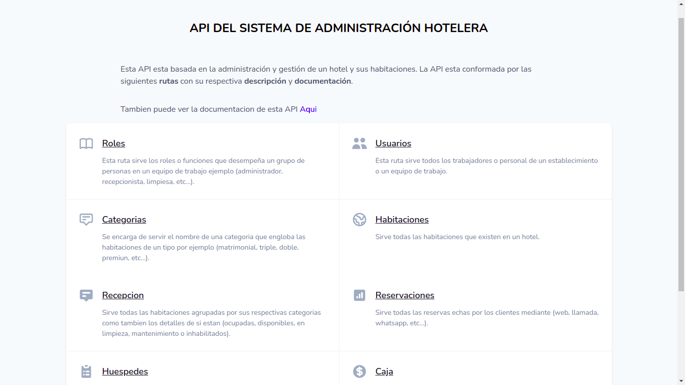
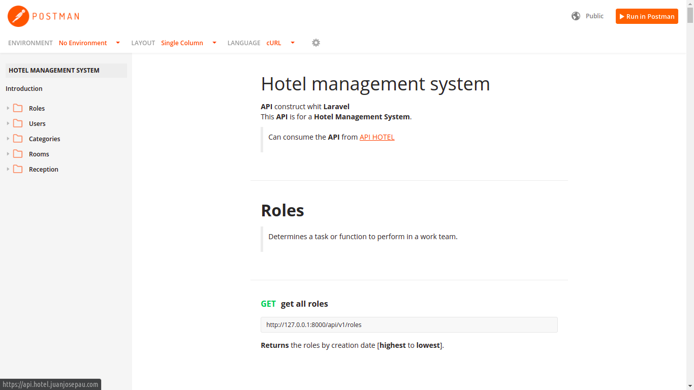

# [API del Sistema de Gestión Hotelera](#)


>Ver Demo [Api Hotel App](http://api.hotel.juanjosepau.com "Ver demo")

### REQUIREMENTS
``` bash
composer 2.5.8 # or any version no difference

php 7.3 # or php.7.4 not tested

mysql or postgresql
```

### SETUP
``` bash
# comand basic
composer install

cp .env.example .env

php artisan key:generate

php artisan storage:link

# comand migrate table or tables with seeders
php artisan migrate
# or
php artisan migrate --seed

# configure variables .env
# Prod -> hotel.com
# Dev -> localhost:9000 [frontend]
SANCTUM_STATEFUL_DOMAINS=localhost:9000

#Prod -> api.hotel.com
#Dev -> localhost [api]
SESSION_DOMAIN=localhost

# lauch api
php artisan serve
# or
php artisan serve --host localhost
```


### API encargada de servir los datos de la administración del Hotel,  puede consumir la API y ver su [Documentación](https://documenter.getpostman.com/view/15269471/TzCS4kXs "Ver documentación de la api").
### La API fue creada con PHP y el framework de Laravel.

### Esta api es quien se encarga de servir todos los datos para el funcionamiento del [Frontend](https://hotel.juanjosepau.com "Ver aplicación que consume esta api") de la aplicación.

<br>

## Capturas de pantalla  
> Página principal de la API



> Documentación de la API


